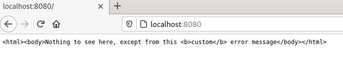
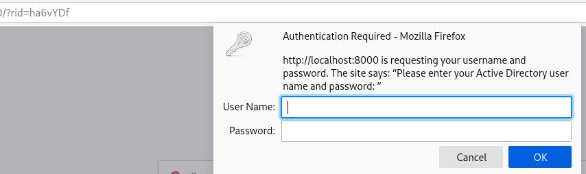
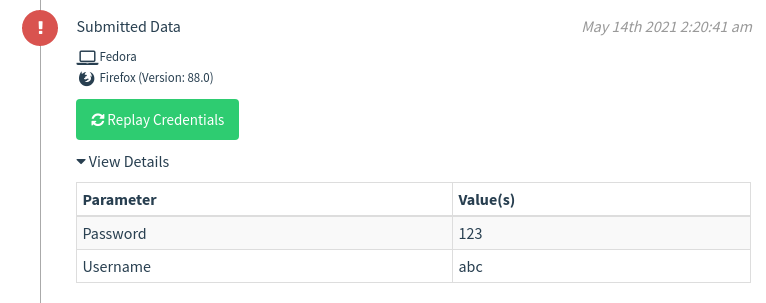

***TL;DR***: *I'll shine a light on Gophish and how to modify it to change behavior or introduce/remove functionality. At the end of this post, you'll know how to host custom 404 pages in Gophish and how to abuse HTTP basic auth instead of login forms embedded on the landing page to obtain juicy creds.*

A few days ago I tweeted one of my modifications to Gophish:



I decided that it is worth to go a little bit into detail on how to modify Gophish.

# Intro

[Gophish](https://getgophish.com/) is an open-source phishing framework.
It has several nice properties, for example, Gophish is platform independent and comes in a single, ready to use binary.
We use Gophish internally a lot because of its flexibility - we've done countless deployments to perform phishing attacks against organizations of any size. The powerful API paired with the self-contained binary and ease of configuration really stand out compared to many other products in this area.

I believe that many people are reluctant to tinker with code on their own; as somebody who also sometimes requires a push or needs to see how easy things may go, I decided to write a blog post where I showcase some modifications to Gophish that may come in handy in some situations. 
If you're a seasoned phisherman and modifying the stuff you use is your daily business, there probably won't be anything of interest in this post.
If you're an occasional user and dislike some behavior or are missing out features, this post may help you getting started. 
When you decide to improve Gophish and think your changes benefit the goals of the Gophish project, I highly encourage you to submit a PR or at least open an issue to discuss if integrating your changes makes sense. 
The Gophish community is really awesome, so there's a chance that your changes may also be introduced in the upstream project, helping others, too.

This post will not cover how Gophish works in detail, so if you're unfamiliar with the tool, I recommend to take a look at the [documentation](https://docs.getgophish.com/user-guide/).

# Why even modding Gophish?

The goal of Gophish is to aid training and educating users about phishing attacks.
Due to the API and some other design decisions, Gophish is really flexible and you can easily automate many things. 
You may also use your supporting infrastructure, for example your reverse proxy, to implement behavior that is not supported by Gophish directly, e.g. URLs you can dictate over phone for vishing without raising suspicions.
With some custom JavaScript in your landing pages, it is also quite easy to do things like "passing the phish" to another framework like the awesome [evilginx2](https://github.com/kgretzky/evilginx2) for attacking users with MFA enabled.
You may also place a [BeEF](https://beefproject.com/) hook, allowing you to go into closer interaction with the victim's browser.
Nevertheless, sometimes, especially for social engineering and red teaming assessments, these options are not sufficient and Gophish needs some adaptions to fit the requirements. 

For this post, I'll showcase two modifications:

1. Return a custom 404 page. 
Gophish's 404 page just prints 404 and there are no customization opportunities. 
I'm pretty sure a seasoned analyst visiting the page will spot the intent of the URL instantly.
A page that blends in better, e.g. a 404 page of a well-known web server like nginx or something that relates to the domain can avoid raising suspicions.
2. Phish users with HTTP auth instead of a phishing page.
Mature organizations have trained their staff to death, so low success rates coupled with a high number of suspicious email reports hitting the SOC are something to definitely expect when sending out your average O365 login page phish.
As an attempt to overcome this, I will modify Gophish to request an HTTP auth on the landing page instead of displaying the phishing page.
This will bring an authentication popup, and because there is an operating system / browser window asking for credentials, I assume there's a higher chance for people to fall for this.

The modifications I'm going to show are quick and dirty.
First, of course I do not want to bloat this post more than necessary.
Second, these modifications are local and on-demand. 
It is beneficial to keep them short and easy to understand, because when you're stressed and in the field, a failing database migration because you messed up somewhere is a unpleasant experience.
Keeping your modifications small and contained also allows you to easily adapt to newer versions - a large set of patches may be more difficult to apply to a newer version in the future.
That said, don't expect nice GUI integrations. 
What you'll get is a custom Gophish with bonus functionality tailored to a specific use case. 
For example, the second modification I'm going to show will completely break the landing page functionality, so this is something to keep in mind.

# Development setup

*You can skip this section if you have worked with Go and Gophish before.*

Gophish is written in Go, which is one of my favorite programming languages.
One thing that is particularly nice regarding Go is that it is a really boring language.
Its syntax is easy to follow and understand. 
You also won't see much [syntactic sugar](https://www.pythonpool.com/python-iterate-through-list/) or [magic expressions](https://www.python.org/dev/peps/pep-0572/) that are unfamiliar to you, which makes it easy to dive in and write your own code.

I usually work on Linux, either Debian or Fedora, but basically it doesn't matter. 
Go is platform independent, so you can follow my steps on Windows or macOS, too.
All you're going to need is a working Go setup (at least v1.10), git, and an editor of your choice - I recommend Visual Studio Code, but in the end it doesn't matter.

First of all, grab a copy of the Gophish code:


[eder@lap]$ git clone https://github.com/gophish/gophish.git
Cloning into 'gophish'...
remote: Enumerating objects: 7764, done.
remote: Counting objects: 100% (40/40), done.
remote: Compressing objects: 100% (31/31), done.
remote: Total 7764 (delta 16), reused 28 (delta 9), pack-reused 7724
Receiving objects: 100% (7764/7764), 53.53 MiB | 5.31 MiB/s, done.
Resolving deltas: 100% (4687/4687), done.


From within the cloned directory, you can run `go build` (if this is your first time, you may want to use `go build -v` to see more details on what is going on) to compile Gophish.
When you're running the build for the first time, it will take a few minutes to fetch all dependencies and build them, but in general, Go is a language that compiles really fast, so compiling the changes later on will barely take seconds.
You can simply run the resulting gophish binary, but you may want to point `listen_url` in the `phish_server` section in `config.json` to a port greater than 1024, unless you're working as root. 
My `config.json` I'll use during this post looks like this:


{
	"admin_server": {
		"listen_url": "127.0.0.1:3333",
		"use_tls": true,
		"cert_path": "gophish_admin.crt",
		"key_path": "gophish_admin.key"
	},
	"phish_server": {
		"listen_url": "0.0.0.0:8080",
		"use_tls": false,
		"cert_path": "example.crt",
		"key_path": "example.key"
	},
	"db_name": "sqlite3",
	"db_path": "gophish.db",
	"migrations_prefix": "db/db_",
	"contact_address": "",
	"logging": {
		"filename": "",
		"level": ""
	}
}


When you first run gophish, it will generate a new random password for the first administrative user:


[eder@lap]$ ./gophish 
time="2021-05-23T13:23:28+02:00" level=warning msg="No contact address has been configured."
time="2021-05-23T13:23:28+02:00" level=warning msg="Please consider adding a contact_address entry in your config.json"
goose: migrating db environment 'production', current version: 0, target: 20201201000000
OK    20160118194630_init.sql
OK    20160131153104_0.1.2_add_event_details.sql
OK    20160211211220_0.1.2_add_ignore_cert_errors.sql
OK    20160217211342_0.1.2_create_from_col_results.sql
OK    20160225173824_0.1.2_capture_credentials.sql
OK    20160227180335_0.1.2_store-smtp-settings.sql
OK    20160317214457_0.2_redirect_url.sql
OK    20160605210903_0.2_campaign_scheduling.sql
OK    20170104220731_0.2_result_statuses.sql
OK    20170219122503_0.2.1_email_headers.sql
OK    20170827141312_0.4_utc_dates.sql
OK    20171027213457_0.4.1_maillogs.sql
OK    20171208201932_0.4.1_next_send_date.sql
OK    20180223101813_0.5.1_user_reporting.sql
OK    20180524203752_0.7.0_result_last_modified.sql
OK    20180527213648_0.7.0_store_email_request.sql
OK    20180830215615_0.7.0_send_by_date.sql
OK    20190105192341_0.8.0_rbac.sql
OK    20191104103306_0.9.0_create_webhooks.sql
OK    20200116000000_0.9.0_imap.sql
OK    20200619000000_0.11.0_password_policy.sql
OK    20200730000000_0.11.0_imap_ignore_cert_errors.sql
OK    20200914000000_0.11.0_last_login.sql
OK    20201201000000_0.11.0_account_locked.sql
time="2021-05-23T13:23:28+02:00" level=info msg="Please login with the username admin and the password b998bc860f37fb41"
time="2021-05-23T13:23:28+02:00" level=info msg="Starting phishing server at http://0.0.0.0:8080"
time="2021-05-23T13:23:28+02:00" level=info msg="Starting IMAP monitor manager"
time="2021-05-23T13:23:28+02:00" level=info msg="Background Worker Started Successfully - Waiting for Campaigns"
time="2021-05-23T13:23:28+02:00" level=info msg="Creating new self-signed certificates for administration interface"
time="2021-05-23T13:23:28+02:00" level=info msg="Starting new IMAP monitor for user admin"
time="2021-05-23T13:23:28+02:00" level=info msg="TLS Certificate Generation complete"
time="2021-05-23T13:23:28+02:00" level=info msg="Starting admin server at https://127.0.0.1:3333"


Navigating to [https://localhost:3333](https://localhost:3333) in your browser will bring up the Gophish admin interface.
Log in with `admin` and the password Gophish prints to the logs.
After changing the password, everything is ready!

# First modification: Return a custom 404 page

When you access Gophish's phishing listener, the page looks quite unpleasant:

It would be nice to have something more appealing, at least for a 404 page, here.

First of all, it is required to find out where the 404 page is rendered. 
The Gophish code is well structured, nevertheless, it is not unusual that it takes some time to figure out where certain functionality is defined.
In this case, the relevant code resides in [controllers/phish.go](https://github.com/gophish/gophish/blob/db63ee978dcd678caee0db71e5e1b91f9f293880/controllers/phish.go).
You can find several calls to `http.NotFound`, which is a [convenience function built into Go's standard HTTP library](https://golang.org/pkg/net/http/#NotFound).

One of the nice things about Go is that it is entirely written in Go. 
This means, you can just click the function name in the documentation and it will bring you to [Go's builtin implementation of NotFound](https://golang.org/src/net/http/server.go?s=64787:64830#L2076):


// NotFound replies to the request with an HTTP 404 not found error.
func NotFound(w ResponseWriter, r *Request) { Error(w, "404 page not found", StatusNotFound) }


Surprisingly, this is really straight forward. 
The request passed in is not used any further, whereas the `ResponseWriter` is passed into the `Error` function, together with the string `404 page not found` and the constant `StatusNotFound`.
The library lists the [defined constants](https://golang.org/pkg/net/http/#pkg-constants) right in the beginning of the documentation (source is [here](https://golang.org/src/net/http/status.go)), and you can see that this is just the value `404`:


StatusNotFound                     = 404 // RFC 7231, 6.5.4


Therefore, it is also possible to call the `Error` function with the value `404` directly, but using the name of the HTTP status is obviously a more ergonomic choice here.
Long story short, no magic to take care of here.

[This](https://golang.org/src/net/http/server.go?s=64501:64553#L2068) is how the `Error` function looks like:

// Error replies to the request with the specified error message and HTTP code.
// It does not otherwise end the request; the caller should ensure no further
// writes are done to w.
// The error message should be plain text.
func Error(w ResponseWriter, error string, code int) {
	w.Header().Set("Content-Type", "text/plain; charset=utf-8")
	w.Header().Set("X-Content-Type-Options", "nosniff")
	w.WriteHeader(code)
	fmt.Fprintln(w, error)
}


Really easy, set some HTTP headers, set the status code and print the error message to the response body.
The issue that arises though, is that this functionality is defined in the inner workings of Go, there is no functionality to pass a custom error message - `NotFound` does not take an argument that allows to pass a custom message.
Since the source code is available, and luckily it is concise, we can just copy it over to the phish controller:


// Overwrite go's internal not found 
func customNotFound(w http.ResponseWriter, r *http.Request) {
	http.Error(w, "<html><body>Nothing to see here, except from this <b>custom</b> error message</body></html>", http.StatusNotFound)
}

After replacing all occurences of `http.NotFound` with `customNotFound` in the file, recompiling Gophish (just another `go build`) and running the new binary will produce the following 404 message when a site is not found:

That was easy! 
Unfortunately, the sophisticated HTML placed for the sake of demonstrating the next issue is not rendered. 
There's custom text now, but it doesn't look unsuspicious yet.
The issue here is that the `Error` function sets the HTTP Response's `Content-Type` to `text/plain`, instructing the browser to not render the response:

w.Header().Set("Content-Type", "text/plain; charset=utf-8")

Again, this can easily be solved by copying over the builtin error function, changing the relevant header:


// Overwrite net.https Error with a custom one to set our own headers
// Go's internal Error func returns text/plain so browser's won't render the html
func customError(w http.ResponseWriter, error string, code int) {
	w.Header().Set("Content-Type", "text/html; charset=utf-8")
	w.Header().Set("X-Content-Type-Options", "nosniff")
	w.WriteHeader(code)
	fmt.Fprintln(w, error)
}

// Overwrite go's internal not found
func customNotFound(w http.ResponseWriter, r *http.Request) {
	customError(w, "<html><body>Nothing to see here, except from this <b>custom</b> error message</body></html>", http.StatusNotFound)
}

The snippet already contains the modified `customNotFound` defined earlier. 
When being stressed and tired, changing references is one thing often overlooked. 
I recommend you to somehow track what you intend to change.
You can use your text editor to find all relevant occurences and replace them automatically with the desired function. 
I also recommend you to step through all occurrences, otherwise you may also replace stuff you did not intend to change; This is not the place to save time by working sloppily.
The result looks like this:

That's what I call a good looking, unsuspicious error message rendered from HTML! 
Jokes aside, this is everything it takes to get more control over 404 error pages in Gophish.
You could now inline your HTML, I went for a more fancy approach and used Go's templating engine and a nginx error page to render the final page from a file.
As this is barely related to changing the Gophish behavior and just bringing in personal preferences, I'll just leave you with [the code](https://github.com/edermi/gophish_mods/commit/4a65e390cd0914ab77ea56ca03edc3cc67821d45) additionally containing my 10 LOC templating logic plus the nginx template. 
It is using Go's templating instead of Gophish's internal templating functionality (which is just some abstraction to Go's templating, really not a big deal).
As I said, keeping changes simple and future-compatible is one of my goals when modifying stuff. 
The less you change, the better.

# Second modification: Using HTTP auth for phishing

## Quick intro

Gophish's workflow for phishing is to send mails to users, which then hopefully click the link and submit their credentials on the landing page.
We maintain a huge set of ready-to-use templates with different functionality and stories internally, but all of them are regular web pages that ultimately require the user to submit their data in the embedded form.
Recently, I came across a target that invested tremendous efforts on training their employees.
75% of the targets reported my phishing attempts, regardless of the story, and only 3% submitted their data, all of them on a story that unintentionally matched a legit internal bonus program, so even these small numbers were pure luck. 
Just to be clear: Particularly one of my stories was top notch and I was absolutely sure at least 20%, in the worst case, will fall for it. 
No one did.

This brings me to the second Gophish modification I came up with.
Instead of hosting a landing page and trying to convince the user that this is the right place to put their credentials, I'll ask them to authenticate via HTTP Basic Authentication (see [Wikipedia](https://en.wikipedia.org/wiki/Basic_access_authentication), [MDN](https://developer.mozilla.org/en-US/docs/Web/HTTP/Authentication)).
HTTP has an extensible authentication mechanism built into the standard.
The simplest one is [Basic Authentication](https://datatracker.ietf.org/doc/html/rfc7617), which works by supplying the Base64 encoded credentials in the `Authorization` HTTP header.

Of course, users do not set the HTTP header on their own.
If a page that requires authentication is visited, the server checks for the existence of the header (and, of course, performs authentication and authorization).
If it is not there, the server can respond with a `401 Unauthorized` HTTP response and a `WWW-Authenticate` header, specifying the expected authentication type (in this case `Basic`) and the name of the realm the user is authenticating to.
The string can be freely chosen and is often displayed to the user to indicate where he is currently authenticating to. 
For example, a good value may be `Company XXX Internet Proxy Authentication`.

When the browser receives this request, an authentication window will pop up. 
The interesting thing here is, that this is a browser or, in the best case, operating system window, depending on the victims browser.
To the user, it doesn't feel like entering credentials on a website, but giving the OS / Browser credentials to access the site in the first place.
After the user enters credentials, the browser will take care about the technical details like setting the appropriate headers, to make everything work in the end.
If you're interested in technical details, the links spread across the text are an excellent starting point.

## Making Gophish capable of HTTP auth

So, after the longish quick intro to the use case, let's find out how to implement this in Gophish.
Ideally, the implementation is interoperable with the whole Gophish workflow, so everything should work from sending mails to receiving the data and finally using Gophish's builtin analysis tools for evaluating success of the campaign.
To achieve this, the best idea is probably to modify the landing page listener such that it does not render a phishing page, but issues an HTTP basic authentication request.

Again, `controllers/phish.go`, more concisely, [renderPhishResponse](https://github.com/gophish/gophish/blob/db63ee978dcd678caee0db71e5e1b91f9f293880/controllers/phish.go#L271), is the main part of interest here:


// renderPhishResponse handles rendering the correct response to the phishing
// connection. This usually involves writing out the page HTML or redirecting
// the user to the correct URL.
func renderPhishResponse(w http.ResponseWriter, r *http.Request, ptx models.PhishingTemplateContext, p models.Page) {
	// If the request was a form submit and a redirect URL was specified, we
	// should send the user to that URL
	if r.Method == "POST" {
		if p.RedirectURL != "" {
			redirectURL, err := models.ExecuteTemplate(p.RedirectURL, ptx)
			if err != nil {
				log.Error(err)
				http.NotFound(w, r)
				return
			}
			http.Redirect(w, r, redirectURL, http.StatusFound)
			return
		}
	}
	// Otherwise, we just need to write out the templated HTML
	html, err := models.ExecuteTemplate(p.HTML, ptx)
	if err != nil {
		log.Error(err)
		http.NotFound(w, r)
		return
	}
	w.Write([]byte(html))
}


As you can see, the function handles two different cases: First, a `POST` request indicates that a user submitted data. 
If a redirect URL is specified, the user is sent there.
If the request is not a `POST` request or there is no redirect URL specified, the page is rendered as is.

Before changing anything, there are a few things to note:
- Credentials are not handled here. 
In fact, handling of the submitted data is a bit difficult to find and understand, if you're interested, you may give it a shot before continue reading.
- It is optional to specify a redirect URL in Gophish. 
In this case, it is probably a good idea to overthink this and make it mandatory, so the existing battle-tested redirection logic of Gophish will send a user to a legit site after entering credentials.
- Gophish assumes that `GET` requests are users landing on the page while a `POST` request means that a user submitted data. 
There are no further abstractions or ways to deviate from this concept, so unless building these abstractions, the modifications for HTTP auth based phishing will replace the current logic.
This means that a Gophish server with the patches will not be able to carry out regular campaigns.
Implementing a GUI switch and coexistence of both types will take additional, non-trivial changes.
I accept this limitation.

In this case, I'll make coarse steps compared to the first modification.
I'll present the modifications and walk through them.
Getting there basically works the same as depicted above, and it barely took me an hour in the middle of the night, so don't be afraid when it comes to modifying stuff without knowing where it will take you.
This is the new `renderPhishResponse`:


// Modified http auth version
func renderPhishResponse(w http.ResponseWriter, r *http.Request, ptx models.PhishingTemplateContext, p models.Page) {
	_, _, ok := r.BasicAuth()
	// If the request contains a Basic Auth header, send the user to the redirect URL
	// TODO: Enforce existence of a redirect URL
	if ok {
		redirectURL, err := models.ExecuteTemplate(p.RedirectURL, ptx)
		if err != nil {
			log.Error(err)
			customNotFound(w, r)
			return
		}
		http.Redirect(w, r, redirectURL, http.StatusFound)
		return
	}
	// Otherwise, send a response containing the WWW-Authenticate header and
	// render the template as string there
	stp := bm.StripTagsPolicy()
	w.Header().Add("WWW-Authenticate", fmt.Sprintf(`Basic realm="%s"`, stp.Sanitize(p.HTML)))
	w.WriteHeader(http.StatusUnauthorized)
	w.Write([]byte(`{"message": "You are not authorized to view this page."}`))
}


In line 3, you can see that a call to the `BasicAuth` method of the request. 
The [BasicAuth](https://golang.org/pkg/net/http/#Request.BasicAuth) function is again already defined by Go's `net/http` library and basically returns the provided username, password, and if these values have been provided.
Username and password are not relevant here as they're parsed somewhere else in the code (again, try to stick to the existing workflow). 
Here, only the existence of authentication data is checked.
If authentication data is present, redirect the user to the redirect URL specified in the landing page, otherwise, add an HTTP `WWW-Authenticate` header and set the HTTP status to `StatusUnauthorized` (401).
Note that this snippet contains the `customNotFound` I introduced in the first example.
When working on a vanilla code base, `http.NotFound` is surely a better choice here.
Also note that the realm is set to the HTML code of the landing page. 
This allows to set the realm directly in the landing page editor in the web interface, but I have to get rid of some HTML tags.
This is what `StripTagsPolicy` and `stp.Sanitize()` is for.
I decided the quickest and easiest way to remove all HTML tags is to use [bluemonday](https://github.com/microcosm-cc/bluemonday), a library for sanitizing HTML.
The page object does not expose raw text and this seemed the most straight forward way to remove the HTML tags without doing more substantial changes to Gophish.

So, now there's no differentiation between `GET` and `POST` - what matters is if there is an HTTP Basic Auth sent along, and if not, it is requested.
By changing this function, most of the work is already done. 
What's missing though is the most important part - retrieving the credentials.
The lengthy function [PhishHandler](https://github.com/gophish/gophish/blob/db63ee978dcd678caee0db71e5e1b91f9f293880/controllers/phish.go#L202) takes care of this:


switch {
case r.Method == "GET":
	err = rs.HandleClickedLink(d)
	if err != nil {
		log.Error(err)
	}
case r.Method == "POST":
	err = rs.HandleFormSubmit(d)
	if err != nil {
		log.Error(err)
	}
}


In case of a `GET` request, the "Link was clicked" event is fired, in case of a `POST` request, `HandleFormSubmit` will retrieve the data and insert it into the database.
I'm not going to take a closer look at `HandleFormSubmit`, in essence, and this may be surprising, Gophish is not aware of the concept of usernames and passwords, and actually it doesn't need to.
Gophish has a type called `EventDetails` (can be found in [models/campaign.go](https://github.com/gophish/gophish/blob/db63ee978dcd678caee0db71e5e1b91f9f293880/models/campaign.go#L87)) that stores User Agent and Payload, the latter one containing all parameters sent - including username and password. 
This behavior is by the way also the reason, why you sometimes see more data in the campaign results, for example CSRF tokens or random crap modern web frameworks put there.
Gophish simply stores and displays everything that was sent.
Username and password usually happen to be in that data.

In order to record the data sent via HTTP auth, there are two things to do: Extract the data from the `Authorization` header and present it to Gophish in a way that it believes this was a request body (again, this is the easiest, not the best way).


username, password, ok := r.BasicAuth()
if !ok {
	err = rs.HandleClickedLink(d)
	if err != nil {
		log.Error(err)
	}
} else {
	// d contains a Payload member of type net.url.Values
	// which itself is just map[string][]string
	// Manually overwrite it with basic auth data
	payload := map[string][]string{"Username": []string{username}, "Password": []string{password}}
	d.Payload = payload
	err = rs.HandleFormSubmit(d)
	if err != nil {
		log.Error(err)
	}
}


This time, I'm interested in username and password, so I keep them in appropriately named variables.
In case the Basic auth was not `ok`, meaning there was not Basic auth at all, the click is recorded.
If there was a Basic auth header, the payload for the `EventDetails` struct is manually constructed and the modified object is submitted to `HandleFormSubmit`.
Admittedly, from a coding point of view, creating the data structure in a one-liner is the most challenging part in the whole blog post if you're not familiar with Go.

That's it! 
There's only a small change to `models/page.go` missing in order to enforce the existence of a redirect URL, but this is nothing that is required for the above code to work.
In the beginning of the file, I added a new error type:


var ErrRedirectUrlNotSpecified = errors.New("Redirect URL not specified")


Later on, in [parseHTML](https://github.com/gophish/gophish/blob/db63ee978dcd678caee0db71e5e1b91f9f293880/models/page.go#L29), a check is introduced to make sure the redirect URL is not empty:

if p.Name == "" {
	return ErrPageNameNotSpecified
}
if p.RedirectURL == "" {
	return ErrRedirectUrlNotSpecified
}


## Demo time

I'm just reusing the images from my tweet here, they show how it looks like when a user clicks the link:

This is what the operator sees in the Gophish logs:

# Closing thoughts and tips

First of all, you can find all modifications [here](https://github.com/edermi/gophish_mods).
When I'm stuck while modding, I usually insert some print statements or start the debugger to verify my assumptions.
Assumptions are important. 
Take a piece of paper and draw the control and data flows.
Verify your assumptions by going through the code step by step.
You'll notice that at some point the things that happen deviate from what you expect, often because your assumptions are too vague or simply wrong.
When browsers are involved, I usually do page reloads only from inspector with cache disabled.
I've lost countless hours before realizing that the browser cache still serves a broken variant and my code already worked two hours before.
Taking breaks and going for a walk or a nap also help freeing the mind when you're stuck.

I hope this blog post encourages people to be less reluctant to touch other people's code.
Especially for projects written in Go, it is often quite easy to understand what's going on and especially small changes are really easy to implement.
I've had many cases where tools were missing small features or didn't work in the concrete scenario, most of them were easy to overcome with some custom patches.
Apart from that, I generally recommend all Red Teamers to know what your daily tradecraft does behind the scenes, some things may surprise you and uncover your operation right after you started... 



I also recommend you to look at other branches than main/master and to go through Pull requests.
Often you find interesting stuff you can reuse, for example there's a quite old [beef-integration branch](https://github.com/gophish/gophish/tree/beef-integration) in the Gophish repository and there are Pull requests like [Implement functionality to support custom RId - Ability to specify both the character set and length](https://github.com/gophish/gophish/pull/2162). 
Just because stuff isn't there, for example alternative means of delivering messages, e.g. via WebHook, doesn't mean it has to be this way forever.

I'd love to hear your feedback, so if this post somehow helped you or you have any questions or other feedback, just get in touch.