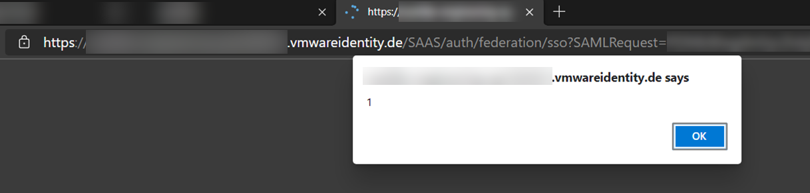

This post is a short notice about vulnerabilities in VMware products I found earlier this year.
During a penetration test of a freshly built environment, I took a closer look at VMware Unified Access Gateway (UAG) in combination with devices enrolled and managed via VMware Unified Endpoint Management (UEM).
I found a reflected XSS vulnerability on VMware's authenticator `vmwareidentity.de` that can be abused by sending links to unauthenticated victims.
Also, I found it possible to export a user's authentication certificate, which allows to access zero trust protected resources without access to the user's device or account on a trusted system.
There has been no advisory or notification for affected customers I am aware of.
The disclosure deadline was already a few weeks ago and VMware did not respond to multiple attempts of contacting them as well as offering an extension of the responsible disclosure timeframe, therefore I am releasing the vulnerability details to the public.

**Disclaimer**: Due to time and access constraints, I did not research the vulnerabilities in detail.
I may also use VMware product names incorrectly, but since I'm spending my free time on writing up vulnerabilities in products of a multi billion dollar company without compensation, I did not spend additional time on researching the correct use of their brands and marketing terminology.

## Vulnerabilities

### Context

VMware Unified Access Gateway (UAG) is a reverse proxy that can be used to protect company resources in a zero trust setup.
Internal resources like an intranet or applications are published to the internet via UAG.
Once unauthenticated users try to access such a resource from the internet, UAG will forward them together with a SAML request to `<customer>.vmwareidentity.de`, where an authentication workflow is triggered.

Any legit user, i.e. owning a company-enrolled device and having the permissions to access the resource, has an authentication certificate installed by the VMware device management (VMware Unified Endpoint Management, UEM / Workspace One).
During the authentication workflow, `<customer>.vmwareidentity.de` will request the client to perform a TLS client authentication using this certificate.
The certificate is the only source providing information about the client, for example user name. 
If this authentication succeeds, the workflow moves on and may eventually return a session ID that will allow the client to pass through UAG and access the protected resource.
In some cases, UAG may be configured to perform a Kerberos delegation of the user against the target application, such that the user has direct access to the application without further authentication steps.

### Exporting the device's authentication certificate

The certificate is marked non-exportable, therefore it is not possible to export it using `certmgr.msc`.
Additonally, enrollment was configured to enforce TPM-backed storage of the certificate in the VMware cloud console, so the private key of the installed certificate is expected to be protected by the TPM (I assume similar to virtual smart cards), so exporting the certificate must not be possible.
Surprisingly, the certificate can be exported in a non-elevated(!) user context using mimikatz:

~~~
crypto::capi
crypto::certificates /export
~~~

The exported certificate was imported into Burp to verify that it indeed allows to access resources behind UAG, impersonating the user the certificate is issued to.
The certificate has a validity of 10 years and there seem to be no checks if the system accessing the resource is indeed the user's system.
Nevertheless, there seems to be a background check if the linked system is still enrolled and compliant when accessing a resource.

An attacker who gained temporary access to an enrolled and compliant system in the context of a user may abuse this issue to potentially gain persistent access to resources protected by UAG, even without still having access to the user or the device as long as the device is still enrolled and compliant (I did not research this in detail, the authentication decision will most likely take other parameters into account, too).

### Reflected XSS on vmwareidentity.de

When accessing a resource protected by UAG, the user must first authenticate against the authenticator at `<customer>.vmwareidentity.de`. 
Upon the first request, UAG returns a redirect containing a SAML message that needs to be passed to the authenticator.
An attacker that tampers the SAML message to contain invalid XML can craft a valid reflective Cross-Site-Scripting payload that is executed in the context of `<customer>.vmwareidentity.de`.
The payload is a base64-encoded GET parameter, therefore users can be attacked by sending them benign-looking links.
Clicking such a link is enough to trigger the vulnerability.

Because the SAML signature may be omitted, there is plenty of space for even more complex JavaScript payloads. 
I did not further evaluate the potential impact, but I assume that a clever attacker manages to gain something useful from reflected XSS on a trustworthy site that also happens to be an authentication endpoint.

## Disclosure

- 2021-05-07: Initial contact with VMware.
- 2021-05-07: VMware states that security testing of *.vmwareidentity.de is not permitted according to their cloud service offering TOS. Further information of used software versions is provided.
- 2021-05-13: VMware asks further details regarding Mimikatz version and if I am able to provide a recording of the specific steps. Information is provided. I also offer them to have a call and do a live demo.
- 2021-05-17: VMware asks for further steps on how to reproduce the certificate retrieval. I record a screencast, proofing exportability and access to protected resources using the authentication certificate.
- 2021-05-25: Asking VMware for feedback and confirmation of the vulnerabilities.
- 2021-05-26: VMware responds: Regarding the exportable certificates, the team is still investigating. The missing signature check is expected behaviour, "The reason that an unsigned SAML request is not rejected is that the protocol says 'MAY', not 'SHALL'". The XSS vulnerability has been reproduced and fixed, but VMware asks to keep this information confidential as wider impact is still evaluated.
- 2021-05-28: I provide VMware further details about the customer.
- 2021-06-29: Asking VMware for progress and feedback. No response.
- 2021-08-09: Asking VMware for progress and feedback, offer to extend disclosure deadline. No response.
- 2021-08-29: Disclosure.

I am not aware of a security advisory sent out to affected customers.
No CVE has been assigned and no bounty has been paid.