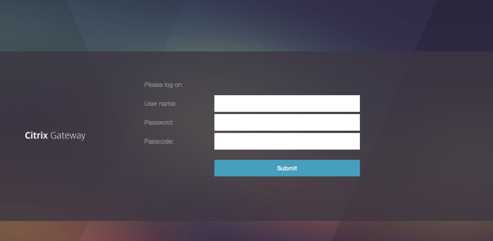
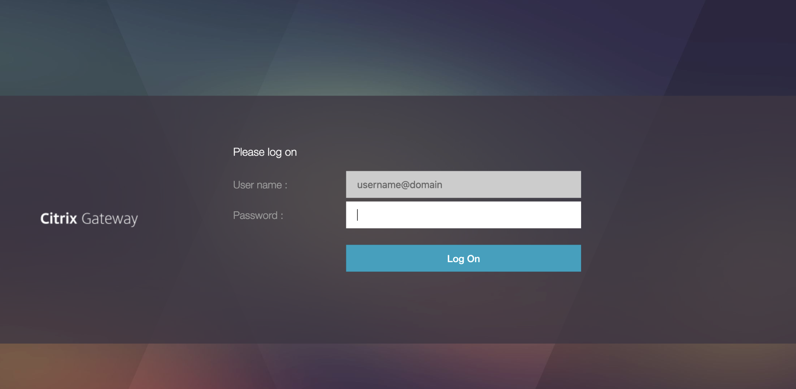
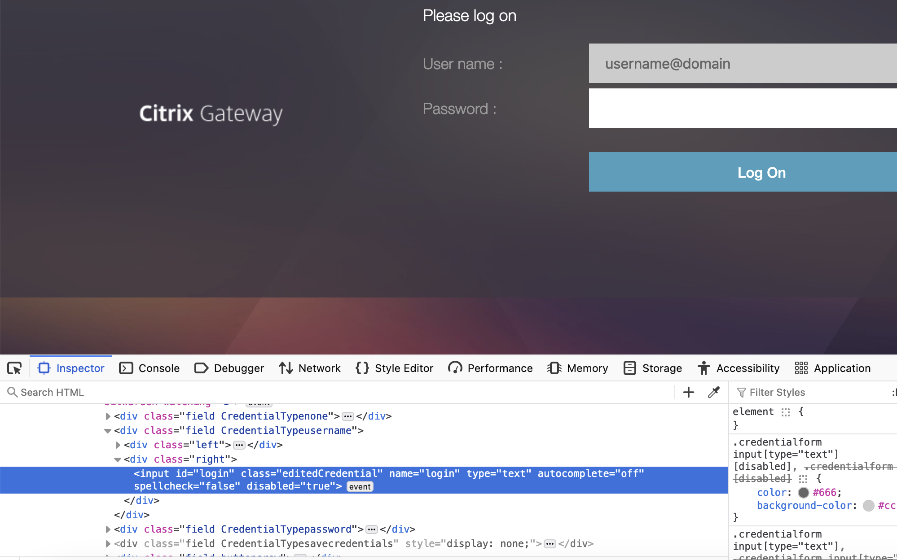
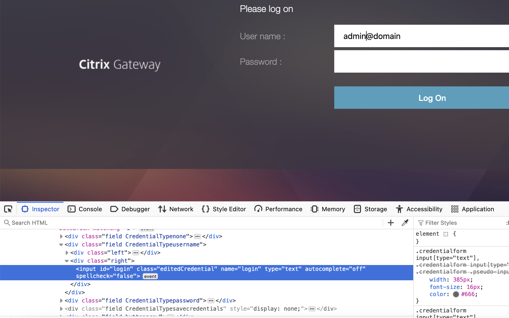

Long time no see! After 3 years of no new blog posts and also no conference talks from my side, I decided it's time to write again. I'll start easy with a fun story that happened a while ago. I gave a short lightning talk about this on [Alligatorcon 2024](https://alligatorcon.eu/index-2024.html), but as it may be of greater interest, ChatGPT and I wrote a little more elaborate version that consists of full sentences. If you prefer clicking through my original slides, [you can find them here](https://github.com/edermi/papers/blob/master/AlligatorconEU2024%20-%20Lightning%20Talk%20Not%20So%20Smart%20Card/Lightning%20Talk%20MFA%20Alligatorcon%202024.pdf).

### Introduction

During a penetration test of a customer’s Citrix infrastructure, my task was to evaluate potential vulnerabilities in their authentication mechanisms and identify possible vectors for initial access. Armed with valid credentials, I was able to scrutinize the authentication process in detail, and it didn’t take long to identify a significant misconfiguration—one that could allow an attacker to bypass multi-factor authentication (MFA) with a surprisingly simple method.

### How Authentication (Usually) Works
In a typical secure environment, the authentication process follows these steps:

1. The user enters their username.
2. The user enters their password.
3. The user provides a one-time password (OTP) from a hardware token, such as an RSA token.

This is how it often looks like:

This is widely state of the art, and though considered secure, it isn't perfect: "Sophisticated" attackers (those being hacked always say the hackers have been sophisticated, so whatever...) may use tools like [Modlishka](https://github.com/drk1wi/Modlishka) or [Evilginx](https://github.com/kgretzky/evilginx2) to perform phishing attacks, where traffic is routed via the attacker's server but ultimately sent to the original target, leading to a succesfull authentication for the victim while the attacker sniffs all the creds and tokens.

### The Customer’s Approach
In this case, the customer decided that additionally to this common process, it might be a good idea to utilize their already existing Public Key Infrastructure (PKI). Each user was issued a smart card containing their personal certificate, which was mandatory for logging into regular clients. The idea was that if this system works for physical devices, extending it to secure remote access should be straightforward and provide additional security. In theory, hardware tokens like smart cards should leave no room for intruders, as even modern reverse-proxy based phishing attacks won't be able to intercept that connection. Also, you don't have to buy and manage RSA tokens for each user.

### A Quick Recap on Mutual TLS (mTLS)
For those unfamiliar with mutual TLS (mTLS), it’s an enhancement of regular TLS. In mTLS, the server not only authenticates itself to the client but also requests a certificate from the client for verification. This ensures that both parties present valid and trusted certificates to establish a secure connection. If you're interested in details, you may start your journey [here](https://en.wikipedia.org/wiki/Mutual_authentication#mTLS).

As part of the mTLS process, the server sends the client a list of trusted Certificate Authorities (CAs), allowing the client to select the appropriate certificate for authentication. 

### The Actual Implementation
In this particular setup, the Citrix endpoint attempted to establish an mTLS connection. If the client certificate wasn’t provided or the connection failed, the system would fall back to regular TLS (where only the server is authenticated). At that point, the user was prompted to enter their username, password, and RSA token.

However, if the mTLS connection was successfully established, the system extracted the User Principal Name (UPN) from the user’s certificate. The login screen would then display a form with the username pre-filled (and greyed out) based on the UPN, and the user would be asked to provide their password:

This process was designed to be seamless and transparent, requiring no additional software and providing a convenient "quality of life" as well as security improvement for users who already had smart cards. 

### The Vulnerability: Bypassing MFA
Although the username field was greyed out, this was merely a superficial HTML attribute. Using the browser’s developer tools, it was possible to modify the form directly and remove this restriction. Once that was done, the username field became fully editable, and I could attempt to log in as any user, provided I knew their password.

Before:

After:

This vulnerability meant that if an attacker obtained *any* certificate issued by the company, phishing or credential stuffing attacks became feasible, as there was effectively no MFA enforcement once the certificate was in hand. As the modifications can be done from within the browser's inspector, it isn't even required to hook Burp or any other tooling into the connection (which usually isn't fun with smart cards).

### What’s Happening Under the Hood?
The issue stemmed from how the system handled the UPN extracted from the certificate during mTLS authentication. The UPN was used to populate the username field, but the system did not perform any subsequent checks to ensure that the individual logging in was the same as the one associated with the certificate.

This oversight allowed anyone with access to a valid certificate (not necessarily the user's certificate) to authenticate with just a username and password, bypassing the intended multi-factor authentication process entirely. At this point, phishing user's passwords becomes powerful again!

### Any Certificate?
An interesting discovery was that even computer certificates (or probably others, like web server certificates, etc., didn't test those though) could be used for mTLS authentication. While these certificates didn’t contain a UPN, the system would fall back to the username "anonymous", but as we're going to provide the desired usernames on our own, this was not a big issue.

As for obtaining a computer certificate? It didn’t require advanced hacking tools. No need for Mimikatz or specialized certificate extraction techniques. Simply requesting a new certificate (I had a client and sufficient privileges) and ensuring the private key was marked as exportable was enough to get a valid certificate that was not tied to hardware and could be used from any system.

### Conclusion
This vulnerability highlights an important lesson: when designing or evaluating authentication mechanisms, it is crucial to ensure that the credentials and identities used are consistently validated, as attackers may try to alter them during the authentication flows. Otherwise, you’re left with rather a VPN connection (technically, it's even zero trust!), but not truly enforcing multi-factor authentication.

*Final remark*: This is not a vulnerability in Citrix, Browsers, the PKI, RSA or any other involved software; it's a misconfiguration in a specific setup. This isn't even specifically related to Citrix, you could introduce this vulnerability on any application by configuring it this way. Hence there is no CVE and, unless your MFA is selfmade like this example, no immediate risk for users.
Apparently, the customer implemented a fix and the application takes care that the same user that authenticates via mTLS also authenticates on the application.